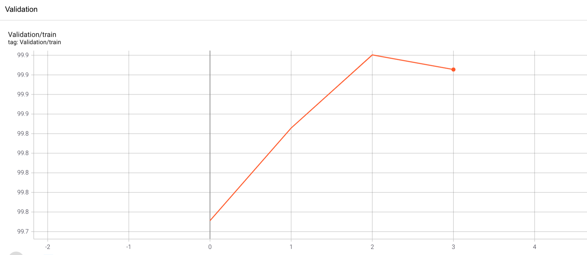

# Dog or Cat Classification Challenge of MBZUAI

## About

Overview on kaggle: https://www.kaggle.com/c/dogs-vs-cats/overview

## Prerequisites
numpy
pandas
torch >=1.8.0
torchvision
tensorboard
scikit-learn
## Training
Use: ``python main.py`` (temporarily)
## Test and Results

### Resnet50 (finetuned) 
Epoch| Train_Loss |Train_Acc |Valid_Loss |Valid_Acc
 --- | ------- | ---- | -------| ------
0 | 0.0468 | 98.457 | 0.0304 | 98.828
1 | 0.0126 | 99.547 | 0.0300 | 99.141
2 | 0.0009 | 99.701 | 0.0421 | 98.574
3 | 0.0069 | 99.756 | 0.0365 | 99.043
4 | 0.0049 | 99.851 | 0.0620 | 97.852

## merge three different pretrained models

We merged resnet50, inceptionv3 and efficientnet-b4 with a concat of output feature vector. Then using a dropout layer with `p=5`.

Epoch| Train_Loss |Train_Acc |Valid_Loss |Valid_Acc
 --- | ------- | ---- | -------| ------
0 | 0.0505 | 98.21 | 0.0278 | 99.3
1 | 0.0183 | 99.42 | 0.0276 | 99.2
2 | 0.0116 | 99.69 | 0.0299 | 98.0

### Generate csv file for submission

run main.py

use function with prefix like `test_merge(model_path='./tmp/merge_effi/epoch_num_1.pth',batch_size=100,csv_path="./results/final/test.csv",binary=True)`.
