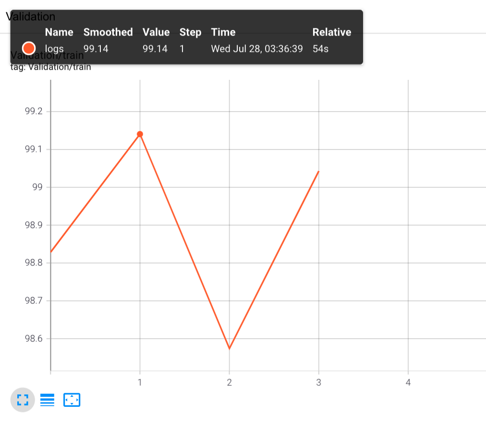

# Dog or Cat Classification Challenge of MBZUAI

## About

Overview on kaggle: https://www.kaggle.com/c/dogs-vs-cats/overview

## Prerequisites
numpy
pandas
torch >=1.8.0
torchvision
tensorboard
scikit-learn
## Training
Use: ``python main.py`` (temporarily)
## Test and Results

### Resnet50 (finetuned) 
Epoch| Train_Loss |Train_Acc |Valid_Loss |Valid_Acc
 --- | ------- | ---- | -------| ------
0 | 0.0468 | 98.457 | 0.0304 | 98.828
1 | 0.0126 | 99.547 | 0.0300 | 99.141
2 | 0.0009 | 99.701 | 0.0421 | 98.574
3 | 0.0069 | 99.756 | 0.0365 | 99.043
4 | 0.0049 | 99.851 | 0.0620 | 97.852

### Generate csv file for submission

TBD.
